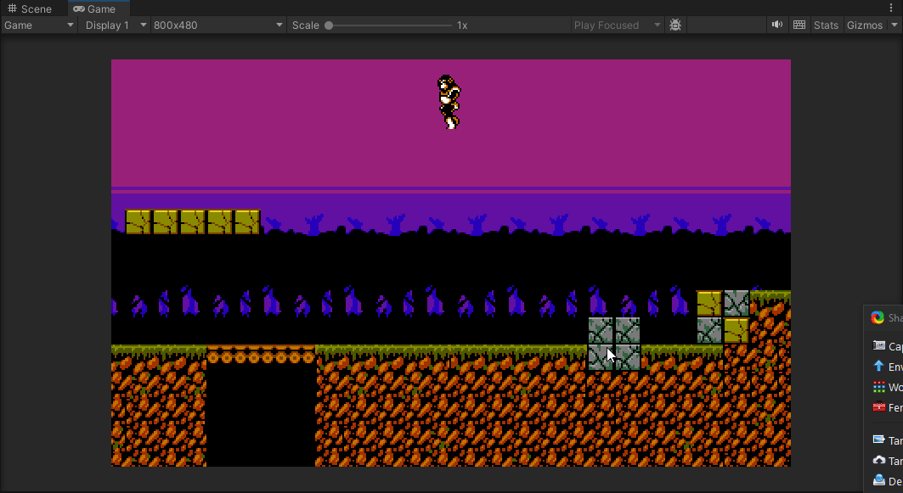
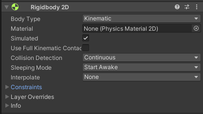

# KinematicCharacter2D-Unity

A simple script that simulates platformer movement in Unity 2022.3 and newer.

## Features
- Acceleration and deceleration (both while grounded or in mid-air)
- Variable jump height (set it to 1 or 0 to ignore)
- Toggle air control  on/off (for Castlevania-style games)
- Coyote time
- Jump buffering

## Why would I use it?
- Easy to use
- Easy to modify
- It's free!
- Makes me happy :)

## Why would I not use it?
- Only works with BoxCollider2D
- No slopes :(

## How do I use it?
The collision code is GameMaker-style, so it should be used in a **Kinematic** Rigidbody2D. 

### Step-by-step
1. Setup Rigidbody2D and BoxCollider2D
2. Drag the KinematicCharacter2D script to a GameObject
3. Create a KinematicCharacterStats2D scriptable object instance
4. Create a LayerMask for the ground and mark the ground as with it
5. Setup the reference (KinematicCharacterStats2D, LayerMask and BoxCollider2D)
6. Hooray!

### Rigidbody2D Settings

